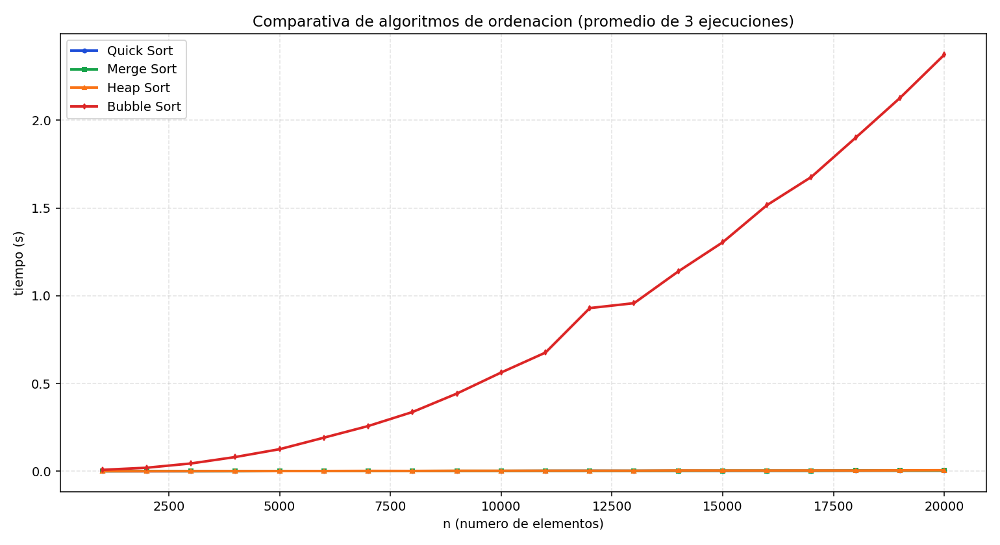

# Informe Final: Comparativa de Algoritmos de Ordenacion con TAD BigDecimal

## 1. Resumen
En esta practica se implementa una comparativa de cuatro algoritmos de ordenacion en C (Quick Sort, Merge Sort, Heap Sort y Bubble Sort) sobre vectores dinamicos cuyo tipo de dato base es un TAD `BigDecimal` de precision arbitraria.

La motivacion principal es medir el coste temporal real de cada algoritmo en un escenario mas exigente que `int` o `double`, usando numeros con longitud variable tanto en parte entera como decimal.

## 2. Objetivos

1. Implementar y validar un TAD `BigDecimal` completo.
2. Integrar el TAD en el vector dinamico del proyecto.
3. Ejecutar una comparativa experimental entre algoritmos de ordenacion.
4. Analizar resultados en terminos de complejidad, coste CPU y memoria.

## 3. TAD BigDecimal implementado

El TAD se define en `big_decimal.h` y `big_decimal.c` y cubre todas las operaciones requeridas:

- Constructores y destructor:
	- `bd_create_from_str`
	- `bd_create_from_int`
	- `bd_free`
- Aritmetica:
	- `bd_add`
	- `bd_subtract`
	- `bd_multiply`
	- `bd_divide`
- Comparacion:
	- `bd_compare`
- Utilidades:
	- `bd_to_string`
	- `bd_print`

Representacion interna:

- `digits`: mantisa decimal sin punto.
- `sign`: signo del numero (`1` o `-1`).
- `precision`: numero de digitos significativos.
- `scale`: numero de digitos fraccionarios.

Esta estructura permite manejar precision arbitraria, limitada solamente por la memoria disponible.

## 4. Integracion en el proyecto

El `vector_t` almacena `BigDecimal *` y gestiona su ciclo de vida con copia defensiva y liberacion correcta.

Aspectos clave:

- `vector_asignar` clona el valor entrante para evitar aliasing.
- `vector_liberar` recorre y libera cada elemento del vector.
- Las comparaciones de orden usan `bd_compare`.

Con ello, Quick, Merge, Heap y Bubble trabajan todos sobre el mismo tipo de dato arbitrario.

## 5. Metodologia experimental

- Lenguaje: C11.
- Sistema de medida: `clock()`.
- Repeticiones por tamano: 3.
- Rango de tamanos: de 1000 a 20000, paso 1000.
- Dataset: BigDecimal pseudoaleatorio de longitud variable.
- Validacion: tras cada ordenacion se comprueba que el vector queda ordenado.

El benchmark usa el mismo vector base clonado para cada algoritmo, garantizando comparacion justa.

## 6. Complejidad teorica esperada

| Algoritmo   | Tiempo promedio | Peor caso | Memoria extra |
|-------------|-----------------|-----------|---------------|
| Quick Sort  | $O(n \log n)$  | $O(n^2)$  | $O(\log n)$ por recursion |
| Merge Sort  | $O(n \log n)$  | $O(n \log n)$ | $O(n)$ |
| Heap Sort   | $O(n \log n)$  | $O(n \log n)$ | $O(1)$ |
| Bubble Sort | $O(n^2)$        | $O(n^2)$  | $O(1)$ |

## 7. Resultados

Archivos generados:

- `tiempos_ordenacion.tsv`
- `grafica_comparativa_ordenacion.png`
- `tiemposFibonacciRecursivo.txt` (compatibilidad historica)

Grafica comparativa:



Lectura principal de resultados:

- Quick, Merge y Heap muestran crecimiento controlado y bajo coste relativo.
- Bubble escala mucho peor y domina el tiempo conforme crece `n`.

## 8. Analisis tecnico

Impacto del tipo `BigDecimal`:

- Cada comparacion cuesta mas que con tipos primitivos, porque intervienen longitud de cadenas, normalizacion y comparacion decimal.
- Aun asi, la separacion asintotica se mantiene: los tres algoritmos $O(n \log n)$ siguen siendo claramente superiores a Bubble.

Coste de CPU:

- Dominado por numero de comparaciones e intercambios.
- Bubble acumula rapidamente coste cuadratico.

Coste de memoria:

- Merge Sort mantiene su coste auxiliar lineal.
- Quick y Heap son mas contenidos en memoria auxiliar.
- El TAD BigDecimal añade sobrecoste de heap por elemento respecto a enteros nativos.

## 9. Reproducibilidad

### Compilar

```bash
gcc -std=c11 -O2 -Wall -Wextra -Wpedantic main.c quick_sort.c vector_dinamico.c big_decimal.c -o quick_sort_benchmark.exe
```

### Ejecutar benchmark

```bash
./quick_sort_benchmark.exe
```

### Generar grafica

```bash
python generar_grafica.py
```

## 10. Conclusiones

1. El TAD BigDecimal quedo integrado funcionalmente en todo el flujo del proyecto.
2. La comparativa confirma en practica las diferencias de complejidad teorica.
3. Bubble Sort queda descartado para tamanos medianos-grandes en este contexto.
4. Quick, Merge y Heap son opciones viables, con trade-offs entre memoria y estabilidad.

Como conclusion global, usar un tipo arbitrario como BigDecimal hace mas realista el estudio del coste y refuerza la importancia de elegir algoritmo en funcion de la carga real de datos.
