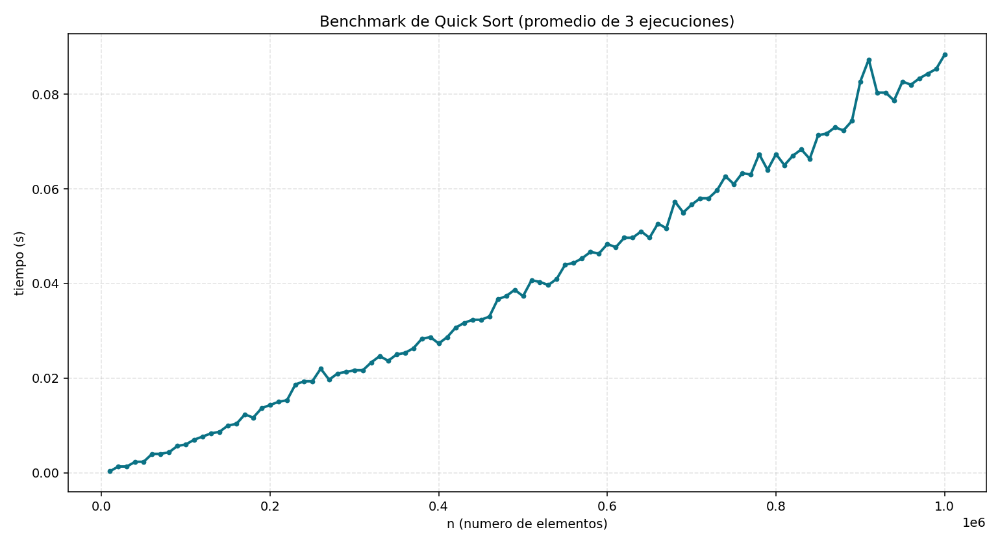

# Informe de rendimiento de Quick Sort

## 1. Objetivo
Medir el tiempo de ejecucion de Quick Sort sobre vectores de enteros aleatorios y verificar que los resultados son coherentes con la complejidad esperada.

## 2. Correcciones aplicadas
Se corrigieron varios problemas de la version original:

- Cabeceras cruzadas y dependencias incorrectas (`quicksort.h` incluia `vectordinamico.h` con errores).
- Uso inconsistente de tipos opacos (`vectorP` como `void *` en cabecera y como struct en implementacion).
- Validacion de limites defectuosa en acceso al vector.
- Implementacion de Quick Sort con limites ambiguos y riesgo de resultados incorrectos.
- Nombre de archivo de salida incorrecto (`tiemposFibonacciRecursivo.txt`).
- Falta de validacion de ordenamiento despues de ejecutar Quick Sort.

## 3. Estandar de nombres aplicado
Se normalizaron nombres de archivos y simbolos al estilo C en `snake_case`:

- `vectordinamico.c` -> `vector_dinamico.c`
- `vectordinamico.h` -> `vector_dinamico.h`
- `quicksort.c` -> `quick_sort.c`
- `quicksort.h` -> `quick_sort.h`
- Funciones: `vector_crear`, `vector_asignar`, `vector_recuperar`, `vector_liberar`, `quick_sort`, etc.

## 4. Metodologia
- Lenguaje: C (C11).
- Algoritmo: Quick Sort con particion tipo Lomuto.
- Datos: enteros pseudoaleatorios.
- Tamano del vector: desde 10,000 hasta 1,000,000 elementos, paso de 10,000.
- Repeticiones: 3 por cada tamano.
- Medida de tiempo: `clock()` y promedio en segundos.
- Verificacion: se comprueba que el vector queda ordenado tras cada ejecucion.

## 5. Entorno de ejecucion
Datos del sistema original de la practica:

- Procesador: AMD FX-6100 Six-Core Processor (3.30 GHz)
- RAM instalada: 8.00 GB
- Sistema: 64 bits

## 6. Resultados
Archivo de resultados:

- `tiempos_quick_sort.tsv`

Grafica regenerada:



## 7. Analisis
La curva de tiempos muestra crecimiento monotono con pequenas fluctuaciones, compatibles con:

- variaciones del planificador del sistema operativo,
- efectos de cache,
- ruido de temporizacion.

El comportamiento global es consistente con un coste promedio de Quick Sort de $O(n \log n)$.

## 8. Reproducibilidad
### Compilar
```bash
gcc -std=c11 -O2 -Wall -Wextra -Wpedantic main.c quick_sort.c vector_dinamico.c -o quick_sort_benchmark.exe
```

### Ejecutar benchmark
```bash
./quick_sort_benchmark.exe
```

### Generar grafica
```bash
python generar_grafica.py
```

## 9. Conclusiones
Como alumno, las conclusiones principales que extraigo de esta practica son las siguientes:

- El comportamiento experimental de Quick Sort coincide con la teoria en el caso promedio: el tiempo crece de forma cercana a $O(n \log n)$ y no de forma cuadratica en los datos aleatorios medidos.
- El coste de CPU aumenta de manera clara al crecer $n$, porque el algoritmo realiza comparaciones e intercambios en cada particion y repite este proceso recursivamente sobre subproblemas.
- Aunque hay pequeñas oscilaciones en la curva, no contradicen el modelo teorico. Se explican por efectos de cache, carga del sistema operativo y precision de la medicion con `clock()`.

En terminos de complejidad:

- Caso promedio: $O(n \log n)$.
- Peor caso: $O(n^2)$, por ejemplo si las particiones salen muy desequilibradas.
- Mejor caso: cercano a $O(n \log n)$ cuando las particiones quedan equilibradas.

En terminos de memoria:

- Quick Sort trabaja "in-place" sobre el vector, por lo que no necesita memoria auxiliar proporcional a $n$.
- El coste extra principal viene de la recursividad (pila de llamadas): en promedio es $O(\log n)$ y en el peor caso puede llegar a $O(n)$.

Respecto al rendimiento practico, esta implementacion es adecuada para conjuntos grandes de datos aleatorios, pero la eleccion del pivote sigue siendo un punto critico. Si el pivote es malo muchas veces, aumenta tanto el tiempo de CPU como el uso de pila.

Finalmente, tambien concluyo que la calidad de la medicion depende mucho de una implementacion correcta: validar limites, verificar que el vector queda ordenado y generar salidas reproducibles es tan importante como el algoritmo en si para obtener resultados fiables.
